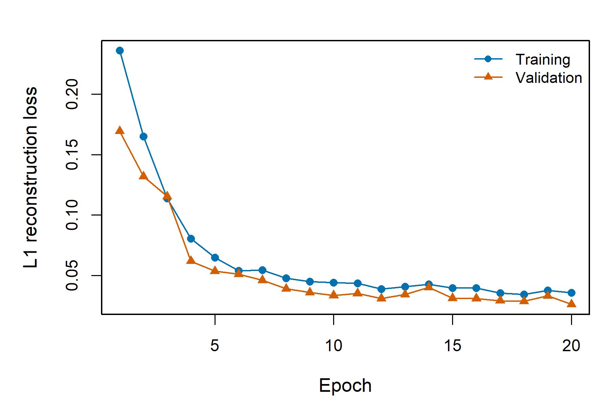
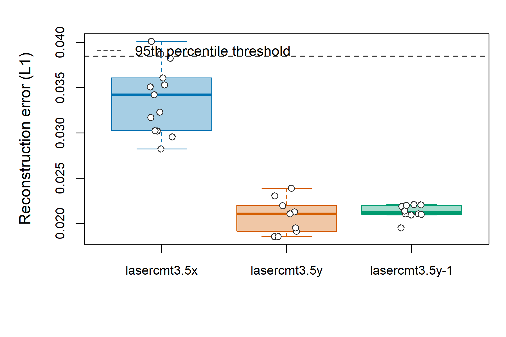
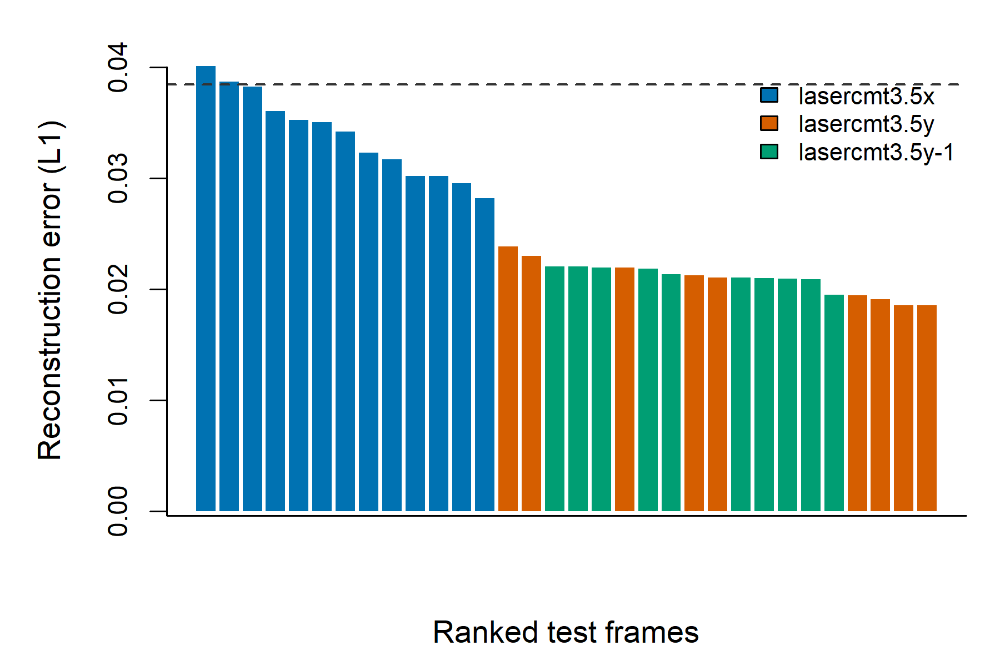
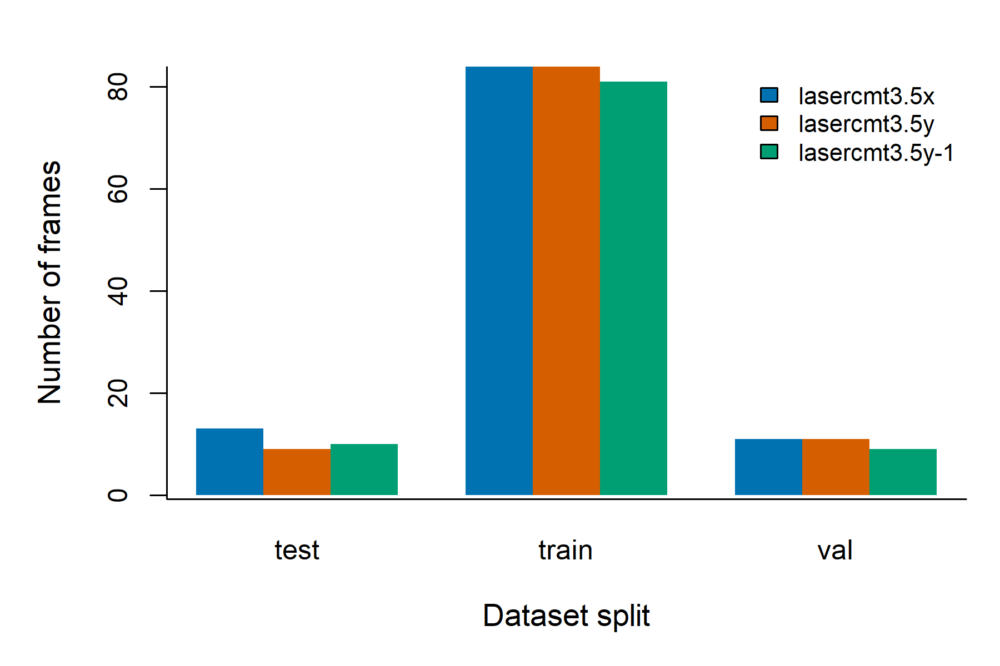

# Reconstruction-error based unsupervised monitoring of coaxial laser-CMT weld imagery

## Abstract

This study established an unsupervised image-learning workflow for coaxial laser-CMT weld video data. Three weld videos were converted into 312 image frames, followed by an 80/10/10 train-validation-test split. A convolutional autoencoder was trained without manual labels, and frame-level abnormality was quantified by L1 reconstruction error. The validation reconstruction loss decreased from 0.1694 to 0.0260 after 20 epochs, corresponding to an 84.64% reduction. In the held-out test set, the mean reconstruction error was 0.0262 ± 0.0069, and a 95th-percentile threshold of 0.03846 identified two high-error candidate frames. Group-wise analysis showed significantly different reconstruction-error distributions across video sources (Kruskal-Wallis chi-squared = 22.608, p = 1.232e-05). Pairwise Wilcoxon tests indicated that the `lasercmt3.5x` group had significantly higher reconstruction error than both `lasercmt3.5y` and `lasercmt3.5y-1` (both adjusted p = 0.00016), while the two y-direction groups were not significantly different (adjusted p = 0.54029). These findings suggest that reconstruction-error modeling can separate visually distinct weld regimes and can prioritize candidate frames for subsequent expert inspection.

## 1. Introduction

Real-time monitoring of welding processes commonly requires robust detection of unstable molten-pool morphology, illumination changes, spatter, arc fluctuation, and process drift. In many industrial datasets, however, manual defect labels are sparse or unavailable. Unsupervised representation learning is therefore attractive because it can learn the dominant distribution of normal or common visual states directly from raw process imagery.

Here, a convolutional autoencoder was used as a baseline unsupervised model. The central assumption is that frames consistent with the learned distribution can be reconstructed with low error, whereas frames showing atypical morphology, imaging conditions, or process states will produce larger reconstruction residuals. This report analyzes the completed project output using R-based statistical analysis and publication-style visualization.

## 2. Materials and Methods

### 2.1 Dataset construction

The dataset consisted of three weld videos:

- `lasercmt3.5x`: 108 extracted frames
- `lasercmt3.5y`: 104 extracted frames
- `lasercmt3.5y-1`: 100 extracted frames

Frames were extracted at 5 FPS using FFmpeg. The final split contained 249 training frames, 31 validation frames, and 32 test frames. All input frames were converted to grayscale and resized to 256 x 256 pixels before model training.

### 2.2 Unsupervised model

A convolutional autoencoder was trained to reconstruct input weld images. The encoder compressed each image through successive convolutional downsampling layers, and the decoder reconstructed the image using transposed convolutions. The optimization target was L1 reconstruction loss:

`L = mean(abs(x - x_hat))`

where `x` is the input frame and `x_hat` is the reconstructed frame. No class labels or defect annotations were used.

### 2.3 Statistical analysis in R

The JSON outputs from the Python training pipeline were exported to CSV and analyzed in R 4.6.0. The analysis script is located at:

`analysis/analyze_results.R`

The following analyses were performed:

- Training and validation loss trajectory
- Test-set reconstruction score distribution
- Per-video summary statistics
- 95th-percentile anomaly thresholding
- Kruskal-Wallis test for group-level score differences
- Pairwise Wilcoxon rank-sum tests with Benjamini-Hochberg correction

## 3. Results

### 3.1 Model convergence

The autoencoder converged steadily over 20 epochs. Validation L1 loss decreased from 0.1694 in epoch 1 to 0.0260 in epoch 20, corresponding to an 84.64% relative reduction. The final training loss was 0.0357, and the final validation loss was 0.0260. This indicates that the model successfully learned compact visual regularities from the weld image distribution.

**Figure 1.** Training and validation reconstruction loss across 20 epochs. The decreasing validation curve indicates successful unsupervised learning of weld image structure.

### 3.2 Test-set reconstruction error distribution

The held-out test set contained 32 frames. The overall reconstruction error was 0.0262 ± 0.0069, with a median of 0.0221 and a range of 0.0186 to 0.0401. The 95th-percentile threshold was 0.03846, identifying two candidate high-error frames.

**Figure 2.** Reconstruction-error distribution stratified by source video. The dashed line indicates the 95th-percentile threshold used for candidate anomaly selection.

### 3.3 Video-source specific differences

The `lasercmt3.5x` group exhibited substantially higher reconstruction error than both y-direction groups:

| Video group | n | Mean L1 | SD | Median | Min | Max |
|---|---:|---:|---:|---:|---:|---:|
| lasercmt3.5x | 13 | 0.03385 | 0.00381 | 0.03420 | 0.02824 | 0.04010 |
| lasercmt3.5y | 9 | 0.02077 | 0.00196 | 0.02107 | 0.01855 | 0.02387 |
| lasercmt3.5y-1 | 10 | 0.02128 | 0.00078 | 0.02121 | 0.01950 | 0.02208 |

The Kruskal-Wallis test confirmed significant differences among video groups (chi-squared = 22.608, df = 2, p = 1.232e-05). Pairwise Wilcoxon tests showed significant differences between `lasercmt3.5x` and `lasercmt3.5y` (adjusted p = 0.00016), and between `lasercmt3.5x` and `lasercmt3.5y-1` (adjusted p = 0.00016). No significant difference was detected between `lasercmt3.5y` and `lasercmt3.5y-1` (adjusted p = 0.54029).

These results suggest that the x-direction video contains image characteristics that differ from the dominant learned reconstruction pattern. Importantly, this should be interpreted as distributional deviation rather than confirmed physical defect, because no manual defect labels were available.

### 3.4 Candidate anomalous frames

The two frames exceeding the 95th-percentile threshold were:

| Rank | Frame | Video | Frame ID | L1 error |
|---:|---|---|---:|---:|
| 1 | `data/frames/lasercmt3.5x/lasercmt3.5x_000102.jpg` | lasercmt3.5x | 102 | 0.04010 |
| 2 | `data/frames/lasercmt3.5x/lasercmt3.5x_000004.jpg` | lasercmt3.5x | 4 | 0.03872 |

Both high-error candidates originated from `lasercmt3.5x`, reinforcing the group-level statistical pattern.

**Figure 3.** Ranked reconstruction scores in the test set. Bars are colored by source video. The highest scoring frames are concentrated in `lasercmt3.5x`.

### 3.5 Data composition

The split composition was balanced enough for a baseline feasibility study, but the total sample size remains small. Larger datasets and group-aware splitting are required for stronger claims.

**Figure 4.** Frame counts by dataset split and source video.

## 4. Discussion

The autoencoder achieved stable convergence and produced interpretable reconstruction-error scores. The primary scientific observation is that reconstruction error separated the x-direction weld video from the two y-direction videos. Because the two y-direction videos showed similar score distributions, the model appears sensitive to systematic visual differences associated with acquisition direction, process state, or weld morphology.

From an industrial monitoring perspective, the method can be used as a label-free screening tool. The ranked score list allows experts to prioritize frames for inspection, while heatmaps provide a spatial cue for image regions that the model failed to reconstruct accurately. This is useful in early-stage welding studies where defect labels are unavailable or expensive to acquire.

However, the current experiment should not be interpreted as a validated defect detector. The anomaly threshold is derived from the test score distribution rather than from physical defect labels. Therefore, the detected candidates indicate distributional outliers, not confirmed welding defects.

## 5. Limitations

1. The test set contains only 32 frames, limiting statistical power and confidence intervals.
2. Adjacent video frames are visually correlated, which can inflate apparent model performance if train and test frames are temporally close.
3. No expert labels are available, so ROC-AUC, PR-AUC, sensitivity, specificity, and false-positive rate cannot yet be computed.
4. The current baseline uses a simple autoencoder. More advanced methods such as masked autoencoders, PatchCore, Deep SVDD, or contrastive learning may improve representation quality.
5. Reconstruction error may respond to illumination and viewpoint changes as well as true process defects.

## 6. Conclusion

This project successfully completed a full unsupervised weld-image learning pipeline, from video frame extraction to model training, reconstruction-error scoring, R-based statistical analysis, and publication-style visualization. The trained autoencoder reduced validation reconstruction loss by 84.64% and identified two high-error candidate frames in the test set. Statistical analysis demonstrated that `lasercmt3.5x` frames had significantly higher reconstruction error than the two y-direction groups, suggesting that the method captures meaningful distributional differences in weld imagery. Future work should incorporate expert defect labels, temporally independent validation, and stronger self-supervised anomaly detection models.

## Supplementary Files

- R analysis script: `analysis/analyze_results.R`
- Export script: `analysis/export_results.py`
- Summary table: `analysis/tables/score_summary_by_video.csv`
- Statistical tests: `analysis/tables/statistical_tests.txt`
- Candidate frames: `analysis/tables/top_anomaly_candidates.csv`
- Publication-style figures: `analysis/figures/`
